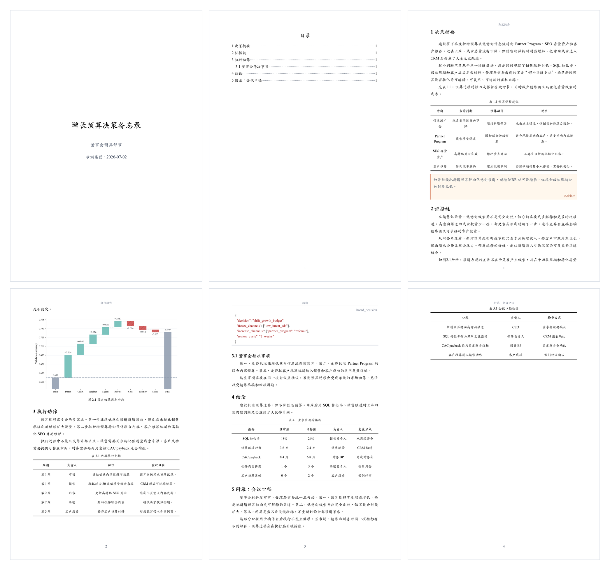
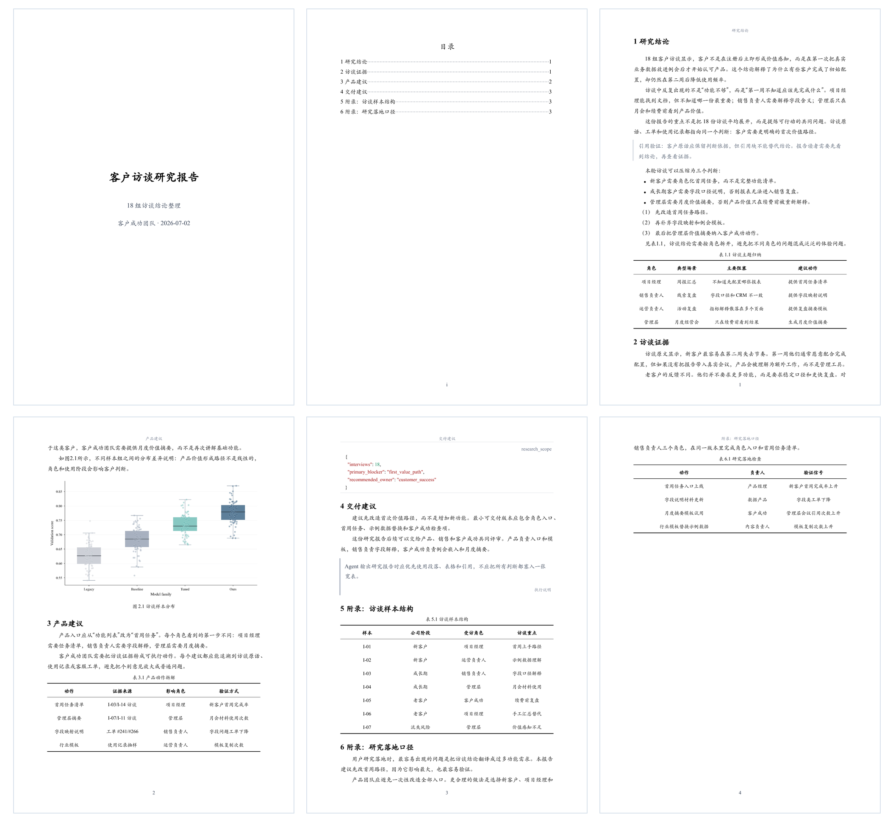
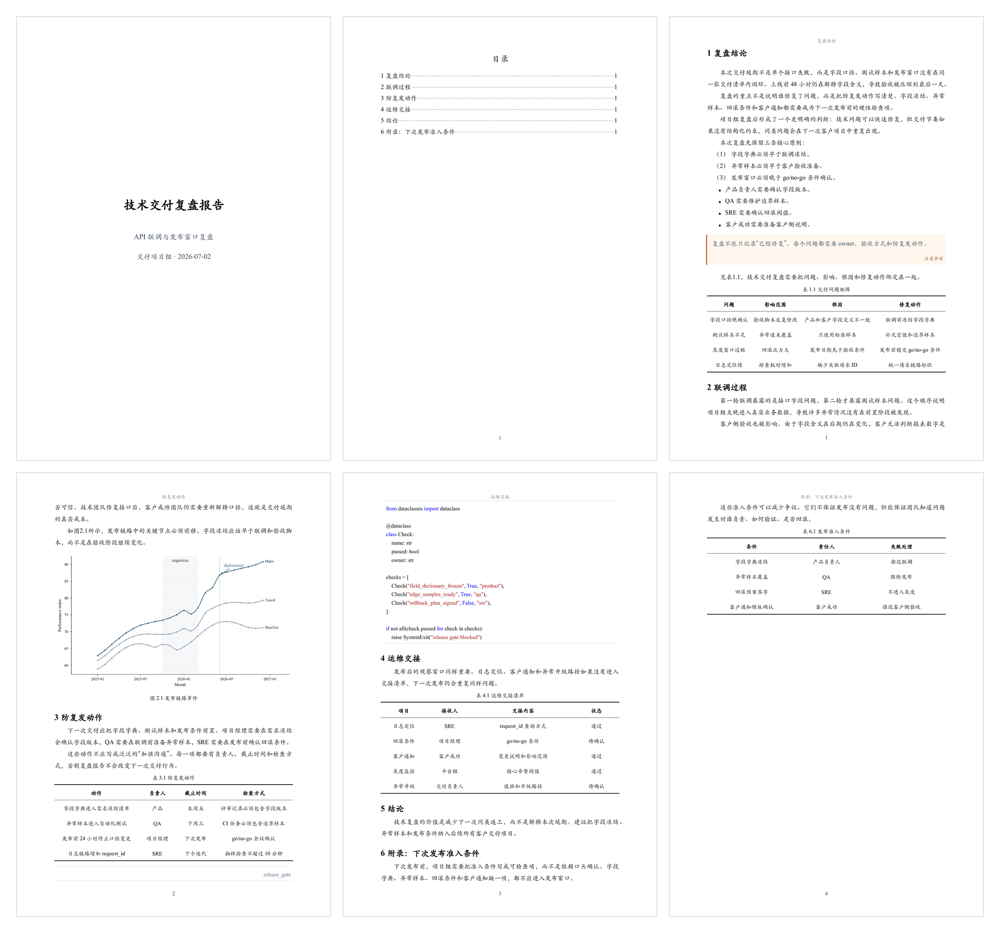
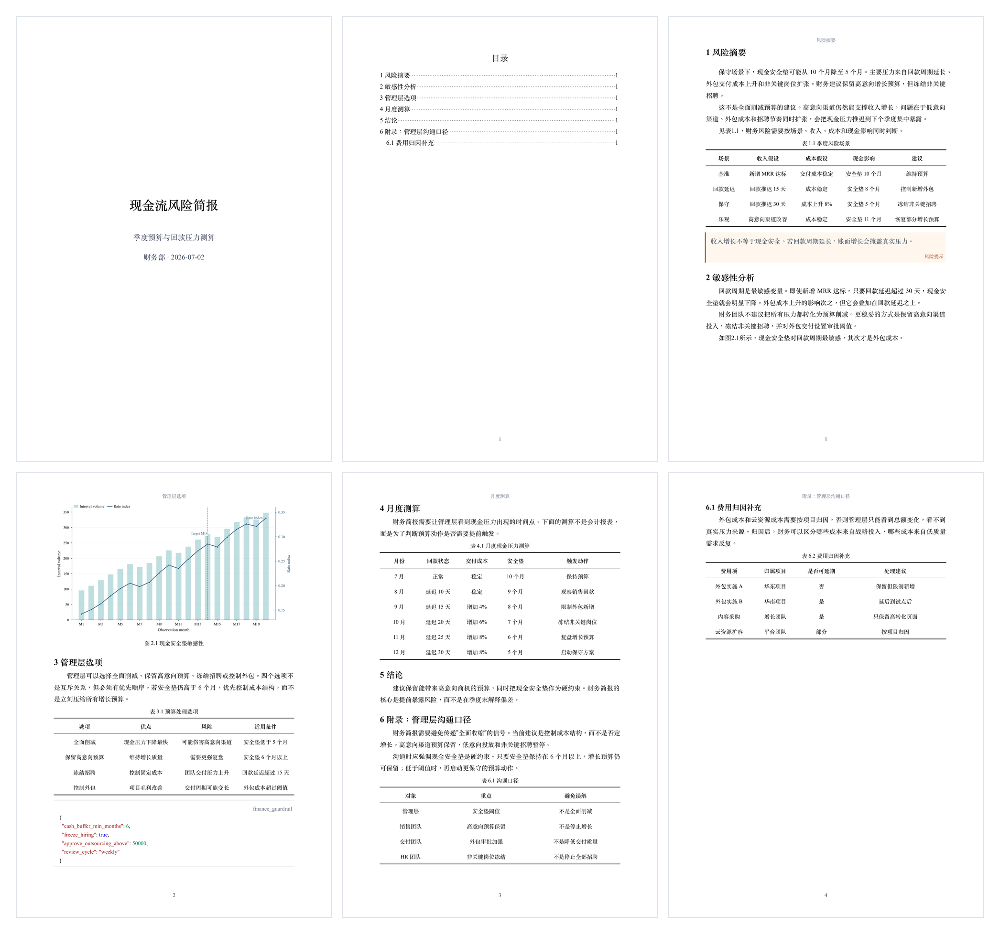
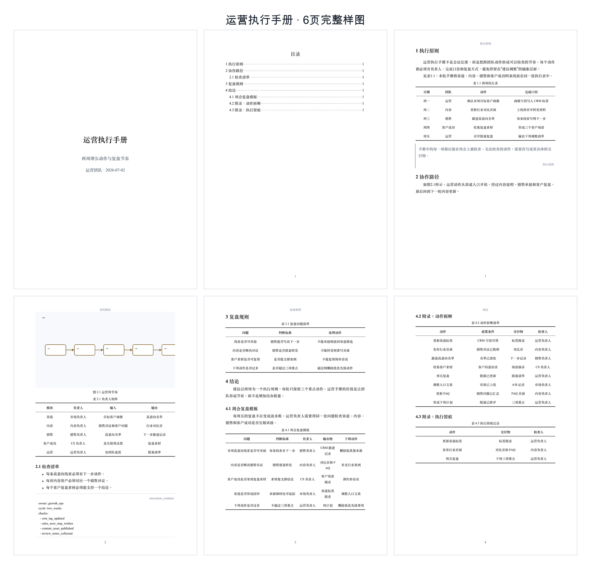
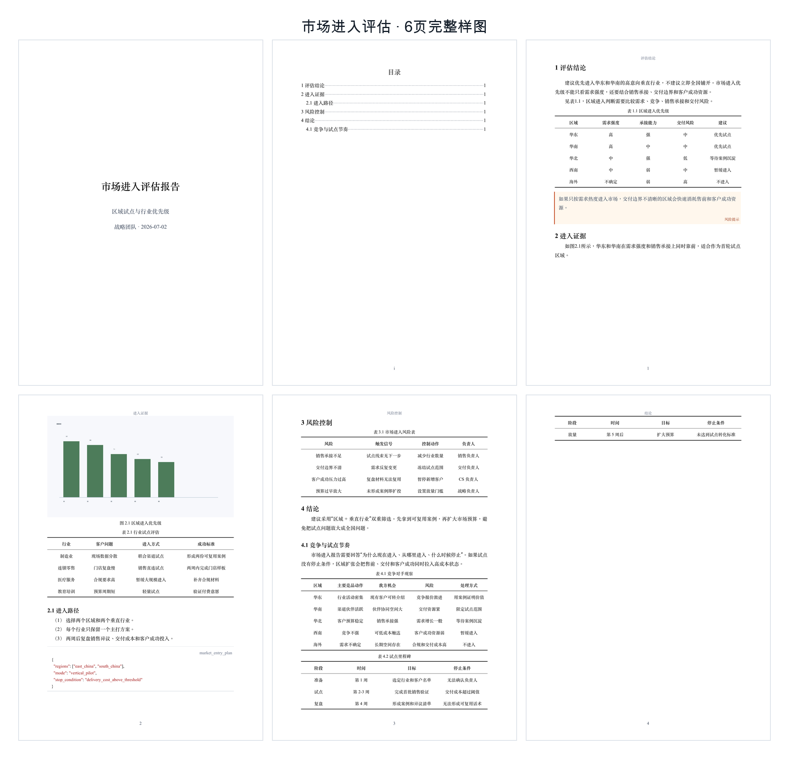

<h1 align="center">DocxKit</h1>

<p align="center">面向 Agent 的 Word 报告导出工具</p>

<p align="center">
  <a href="README.md">English</a>
  ·
  <a href="#安装">安装</a>
  ·
  <a href="#快速开始">快速开始</a>
  ·
  <a href="#效果预览">效果预览</a>
</p>

<p align="center">
  
  
</p>

---

用户提供资料或报告目标，Agent 负责整理内容，DocxKit 负责把最终内容导出为排版稳定、可编辑、可交付的 Word `.docx` 报告。

用户可以提供任意可被 Agent 读取和理解的资料，例如：

- 文档、表格、网页、截图或已有报告。
- 项目材料、调研资料、会议纪要或数据摘要。
- 一个明确的报告主题，由 Agent 自行检索和整理资料。

## 效果预览

以下截图展示 6 份不同业务场景的完整 6 页 Word 报告。

| | | |
|:---:|:---:|:---:|
| <sub><strong>董事会预算决策</strong></sub> | <sub><strong>客户访谈研究</strong></sub> | <sub><strong>技术交付复盘</strong></sub> |
|  |  |  |
| <sub><strong>现金流风险简报</strong></sub> | <sub><strong>运营执行手册</strong></sub> | <sub><strong>市场进入评估</strong></sub> |
|  |  |  |

## 安装

### 1. 安装 CLI

```bash
npm install -g @dztabel/docxkit
docx-kit --version
```

出现类似输出代表 CLI 安装成功：

```text
docx-kit 0.1.31
```

### 2. 安装 Agent skill（二选一）

#### 2.1 Codex

```bash
node -e "const fs=require('fs'),os=require('os'),path=require('path'),cp=require('child_process');const root=cp.execSync('npm root -g',{encoding:'utf8'}).trim();const src=path.join(root,'@dztabel','docxkit','skills','docxkit');const dest=path.join(os.homedir(),'.agents','skills','docxkit');fs.rmSync(dest,{recursive:true,force:true});fs.mkdirSync(path.dirname(dest),{recursive:true});fs.cpSync(src,dest,{recursive:true});console.log('Codex skill installed');"
```

检查 Codex skill 是否安装成功，在终端中输入：

```bash
node -e "const fs=require('fs'),os=require('os'),path=require('path');const p=path.join(os.homedir(),'.agents','skills','docxkit','SKILL.md');if(!fs.existsSync(p))process.exit(1);console.log('Codex skill installed');"
```

出现以下输出代表成功：

```text
Codex skill installed
```

打开 Codex 后输入 `$docxkit`。能按 `Tab` 选中该 skill，代表可用。若未出现，按 `Cmd+K` / `Ctrl+K` 选择 `Force Reload Skills`，或重新打开 Codex。

#### 2.2 Claude Code

```bash
node -e "const fs=require('fs'),os=require('os'),path=require('path'),cp=require('child_process');const root=cp.execSync('npm root -g',{encoding:'utf8'}).trim();const src=path.join(root,'@dztabel','docxkit','skills','docxkit');const dest=path.join(os.homedir(),'.claude','skills','docxkit');fs.rmSync(dest,{recursive:true,force:true});fs.mkdirSync(path.dirname(dest),{recursive:true});fs.cpSync(src,dest,{recursive:true});console.log('Claude Code skill installed');"
```

检查 Claude Code skill 是否安装成功，在终端中输入：

```bash
node -e "const fs=require('fs'),os=require('os'),path=require('path');const p=path.join(os.homedir(),'.claude','skills','docxkit','SKILL.md');if(!fs.existsSync(p))process.exit(1);console.log('Claude Code skill installed');"
```

出现以下输出代表成功：

```text
Claude Code skill installed
```

打开 Claude Code 后输入 `/docxkit`。能选中该 skill，代表可用。若未出现，输入 `/reload-skills` 后重试；旧版本 Claude Code 可重新打开窗口。

## 快速开始

### 1. 用户带资料生成 Word 报告

```text
$docxkit 请读取我上传的 Excel、PDF 和会议纪要，整理成一份正式项目复盘报告并导出 Word。
/docxkit 请读取我上传的 Excel、PDF 和会议纪要，整理成一份正式项目复盘报告并导出 Word。
```

### 2. 用户只给目标，Agent 自行调研

```text
$docxkit 请调研国内储能行业最新进展，整理成行业研究报告并导出 Word。
/docxkit 请调研国内储能行业最新进展，整理成行业研究报告并导出 Word。
```

### 3. 用户已有草稿，Agent 重写成可交付报告

```text
$docxkit 请把这份散乱的草稿改写成结构清晰的正式分析报告并导出 Word。
/docxkit 请把这份散乱的草稿改写成结构清晰的正式分析报告并导出 Word。
```

### 4. 用户基于反馈迭代报告

```text
$docxkit 请把刚才生成的报告压缩到 8 页，第二章改成更适合管理层阅读的版本，并重新导出 Word。
/docxkit 请把刚才生成的报告压缩到 8 页，第二章改成更适合管理层阅读的版本，并重新导出 Word。
```

Agent 会完成资料读取、调研、正文组织、格式约束和 Word 导出。

## 技术细节

Agent 会自动把资料整理成 DocxKit 可处理的中间内容，并调用：

```bash
docx-kit build prepared-report.md --out ./report
docx-kit qa ./report/report.docx --report-json ./report/report.json --out ./report/rendered
```

DocxKit 输出：

```text
report/report.docx
report/report.json
report/build-result.json
report/rendered/qa-result.json
```

生成的 `.docx` 默认嵌入 Kaiti SC 和 Times New Roman 字体子集，保证 Word/WPS/PDF 渲染稳定。

## 排障

当前公开测试版支持 macOS Apple Silicon。

如果全局 npm 安装跳过了 optional dependencies，显式安装对应平台包：

```bash
npm install -g @dztabel/docxkit @dztabel/docxkit-darwin-arm64
```

构建失败时，提交 issue 请附：

- `docx-kit --version`
- `report/build-result.json`
- 可复现问题的最小 `content.md`

## 仓库范围

本公开仓库包含 npm wrapper 元数据、命令 shim、公开 skills、文档和轻量预览资产。

渲染器源码、私有模板、schemas、视觉回归样例和平台二进制不包含在本仓库中。平台二进制通过 npm 平台包分发。

## 许可

DocxKit 以专有 CLI 二进制形式通过 npm 分发。本仓库提供用于安装和使用 CLI 的公开 wrapper、skills 和文档。
